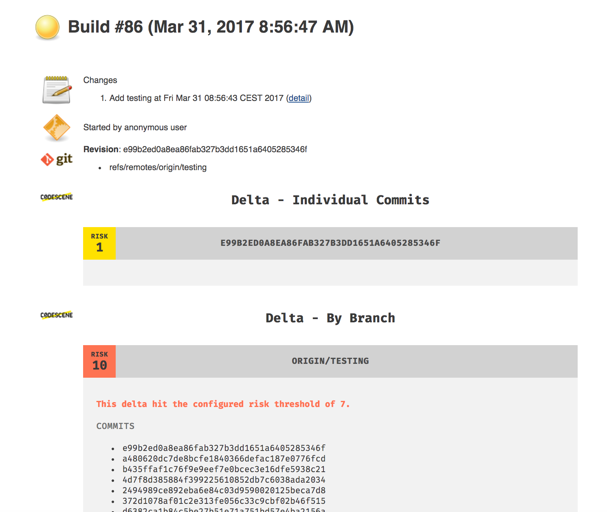
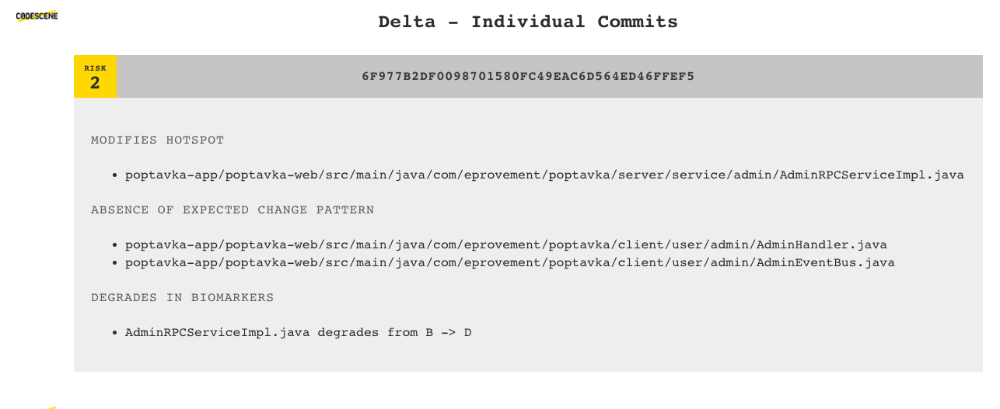
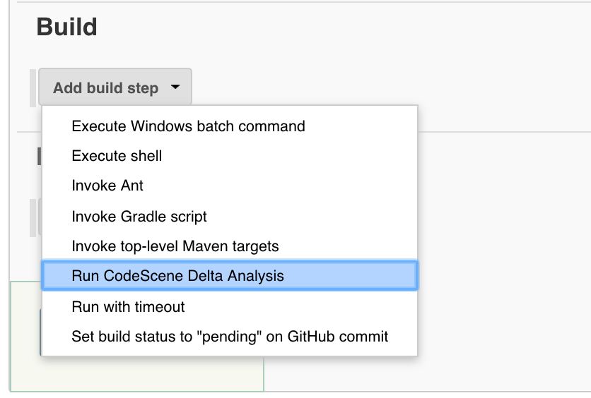
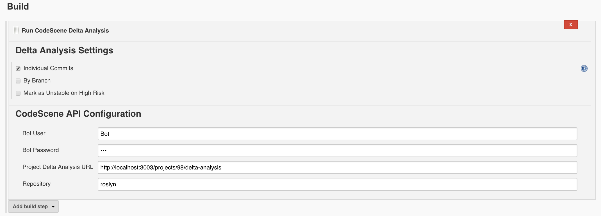
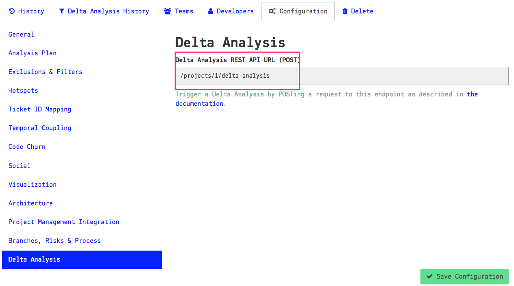

# codescene-jenkins-plugin

A jenkins plugin for
[CodeScene](http://www.empear.com/products/codescene-on-premise/) by Empear.

CodeScene detects potential maintenance problems and early warnings in your
codebase. The earlier you can react to those findings, the better. That’s why
CodeScene offers integration points that let you incorporate the analysis
results into your build pipeline.

This plugin lets you use CodeScene’s Delta Analysis to catch potential problems
before they are delivered to your main branch.

In addition to the risk classification, CodeScene also runs its set of early warning analyses:

The early warnings and risk classification let you prioritize your code reviews and
focus your time where (and when) it’s likely to be needed the most.
Code reviewer fatigue is a real thing, so let’s use our review efforts wisely.

## Installation

The recommended way is to install the plugin via Jenkins Update Center (Jenkins -> Manage Jenkins -> Manage Plugins). You can find the latest version in [Jenkins plugin repository](https://plugins.jenkins.io/codescene).

### Manual build and installation

You can build the latest version of plugin by running `mvn clean package` and installing `target/codescene.hpi`
to your Jenkins manually.

### Configure Jenkins for CodeScene

Enable the CodeScene integration by adding a new build step in your Jenkins configuration. Select the option *Run CodeScene Delta Analysis*.

Enter the required information in the CodeScene Jenkins configuration:

####  Delta Analysis Settings

CodeScene gives you a number of options that controls the scope of the delta analysis:

* *Individual Commits*: Check this option to run a delta analysis on each individual commit. When in doubt, make this your default setting.
* *By Branch*: With this option, CodeScene runs a delta analysis on the difference between the branch you build and the one you provide as reference. Use this option if you want to analyse a whole pull request.

You can also change the defaults for risk threshold and temporal coupling threshold

* *Risk Threshold*: commits with risk equal or higher than this value will make a build unstable
* *Temporal Coupling Threshold*: minimum temporal coupling for "Absence of Expected Change Pattern" warning

By checking the _**Use Biomarkers**_ option, CodeScene lets you auto-detect files that seem to degrade in quality through issues introduced in the current changeset.
Biomarkers can be used since the CodeScene 2.4.0 version.

#### CodeScene API Configuration

The CodeScene API configuration section has to match the information specified inside CodeScene itself and retrievable from the analysis configuration (Project configuration -> Delta Analysis):

API Credentials should be added via [jenkins credentials plugin](https://wiki.jenkins-ci.org/display/JENKINS/Credentials+Plugin).
Check [Injecting Secrets into Jenkins Build Jobs](https://support.cloudbees.com/hc/en-us/articles/203802500-Injecting-Secrets-into-Jenkins-Build-Jobs) for more details.

## Changelog

* 1.1.3
 * Introduce a configuration option to mark builds as UNSTABLE rather than FAILED if a remote CodeScene analysis couldn't be performed.
* 1.1.2
  * Add Biomarkers support to auto-detect files that seem to degrade in quality through issues introduced in a changeset - requires CodeScene version 2.4.0 or higher.
* 1.1.1
  * [BUGFIX: skip delta analysis if there are no different commits between analyzed branch and base revision](https://github.com/jenkinsci/codescene-plugin/pull/1)
* 1.1.0
  * Use [credentials plugin](https://wiki.jenkins-ci.org/display/JENKINS/Credentials+Plugin)
    for storing CodeScene API credentials instead of hardcoded username and password.
    Existing jobs will continue to work, but you won't be able to update job configuration
    (e.g. change username or password) until you switch to the credentials plugin.
    Check [Injecting Secrets into Jenkins Build Jobs](https://support.cloudbees.com/hc/en-us/articles/203802500-Injecting-Secrets-into-Jenkins-Build-Jobs)
    for more details.
  * Only required parameters are now set in constructor.
    Optional parameters are set with setters.
    Check https://github.com/jenkinsci/pipeline-plugin/blob/c84a9af/DEVGUIDE.md#constructor-vs-setters.
    **Original constructor has been removed**!
  * Specify mnemonic extension name "codescene" via `@Symbol` in `CodeSceneBuilder`.
    Check https://github.com/jenkinsci/pipeline-plugin/blob/c84a9af/DEVGUIDE.md#defining-symbols
    and https://wiki.jenkins-ci.org/display/JENKINS/Structs+plugin for more details.
  * Add new configuration field for temporal coupling threshold. The new field is set to 80 percent by default. Requires CodeScene 2.0+, otherwise the new settings doesn't have any effect.
* 1.0.1
  * Add checksums to built artifacts in GitHub releases
* 1.0.0
  * Delta analysis by branch, based on _base revision_
  * Delta analysis by individual commits (new commits not seen in previous jobs)
  * "Mark build as unstable" based on risk threshold

## Contributing

You're encouraged to submit [pull
requests](https://github.com/empear-analytics/codescene-jenkins-plugin/pulls),
and to [propose features and discuss
issues](https://github.com/empear-analytics/codescene-jenkins-plugin/issues).

## License

Licensed under the [MIT License](LICENSE).
